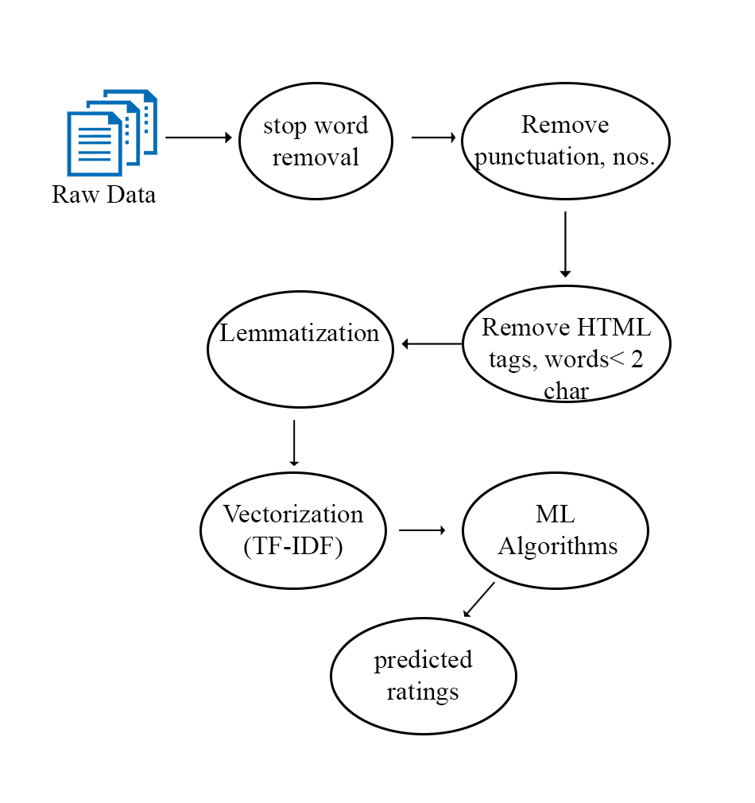
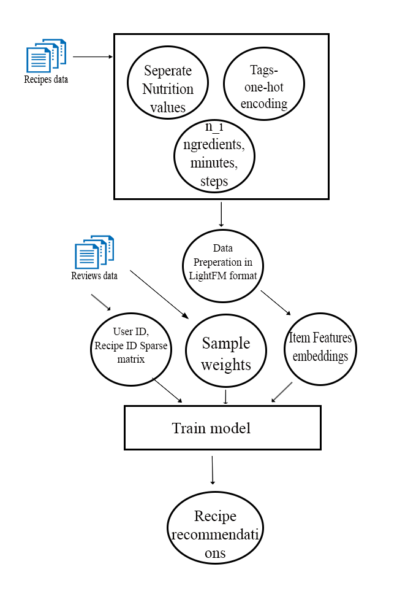

# Building a Hybrid Food Recommendation system

## Architecture

## Data Pre-processing for Reviews

## Overview of LightFM Model

### References:
https://www.kaggle.com/code/ashwinik/recipe-recommendation-bert-sentence-embedding  
https://towardsdatascience.com/how-i-would-explain-building-lightfm-hybrid-recommenders-to-a-5-year-old-b6ee18571309   
https://towardsdatascience.com/recommendation-system-in-python-lightfm-61c85010ce17

